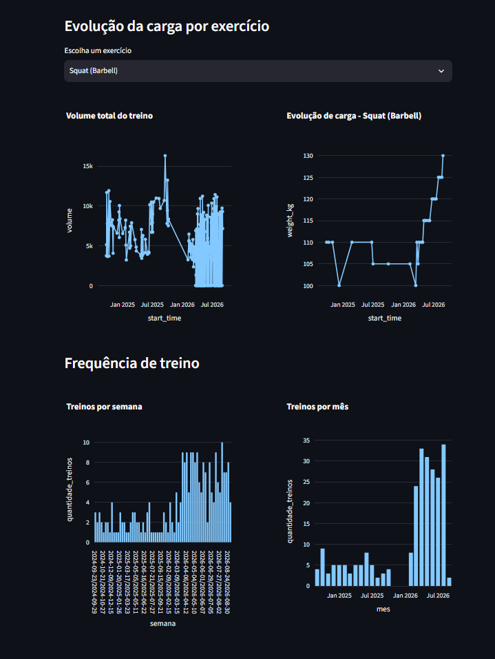

# Hevy Analytics

Dashboard de análise de dados de treino, construído a partir do histórico exportado do app [Hevy](https://www.hevyapp.com/). Projeto criado com foco em aprendizado prático de análise de dados e desenvolvimento backend.

## Funcionalidades

- Limpeza e tratamento de dados exportados em CSV (incluindo conversão de datas em português)
- Cálculo de volume total de treino por sessão
- Evolução de carga máxima por exercício, com seletor interativo
- Dashboard interativo construído com Streamlit

## Tecnologias

- Python
- Pandas
- Streamlit
- Plotly

## Como rodar o projeto

\`\`\`bash
git clone https://github.com/SEU-USUARIO/hevy-analytics.git
cd hevy-analytics
python -m venv venv
venv\Scripts\activate
pip install -r requirements.txt
streamlit run main.py
\`\`\`

> Observação: os dados de treino (`data/workouts.csv`) não estão incluídos no repositório, pois são informações pessoais. Para testar com seus próprios dados, exporte seu histórico do Hevy e coloque o arquivo em `data/workouts.csv`.